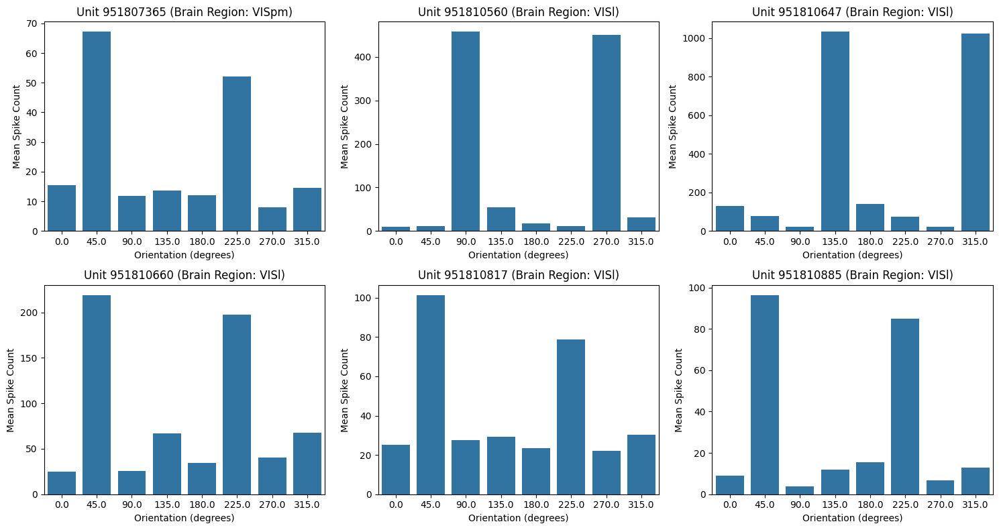

# Neuron Responses to Grating Stimulus Orientations in Mice

Umut Tuna Akgul, Utku Bahcivanoglu, Tommaso Ferracina, George Morris, Tebe Nigrelli

---

## Abstract

We analyze ecephys data from the Allen Brain Observatory [1] to investigate how neural units in the mouse visual cortex respond to static and drifting gratings stimuli. We find that drifting gratings elicit responses from more neurons with higher orientation selectivity, leading to better decoding performance. However, static stimuli activate a smaller subset of highly selective neurons with greater individual impact. We identify brain regions and specific neurons that play a significant role in encoding stimulus orientation, combine neural firing rates over multiple trials and conditions, select the most informative neurons based on their response, and construct an effective decoder to predict stimulus orientation from neural activity.

## Data Processing

For our analysis, we chose $750332458$ for its balanced distribution of units across regions of the brain, and for its coverage of the visual cortex.  This dataset consists of time-aligned responses of neuronal units to stimuli.

<table>
  <tr>
    <th>region</th>
    <th>Total</th>
    <th>Static</th>
    <th>Drifting</th>
  </tr>
  <tr><td>grey</td><td>558</td><td>1</td><td>1</td></tr>
  <tr><td>VISal</td><td>71</td><td>15</td><td>29</td></tr>
  <tr><td>VISp</td><td>63</td><td>9</td><td>19</td></tr>
  <tr><td>VISam</td><td>60</td><td>6</td><td>13</td></tr>
  <tr><td>VISrl</td><td>44</td><td>2</td><td>9</td></tr>
  <tr><td>VISl</td><td>38</td><td>10</td><td>10</td></tr>
  <tr><td>VISpm</td><td>19</td><td>0</td><td>2</td></tr>
  <tr><td>CA1</td><td>16</td><td>0</td><td>0</td></tr>
  <tr><td>CA3</td><td>15</td><td>0</td><td>0</td></tr>
  <tr><td>DG</td><td>7</td><td>0</td><td>0</td></tr>
</table>

Distribution of units across brain regions for all conditions: total, static gratings, and drifting gratings.

In this study we look at static and drifting grating presentations, and consider as the variable only the orientation and as the response only the mean firing rate of individual units over each presentation.

  

    
    
Firing rate statistics across brain regions.

  

  

    
    
Individual firing rate statistics for each brain region.

  

## Exploratory Data Analysis

We observe how spiking rate varies between regions: in general, we notice a linear relation between the log of the mean and the log of the standard deviation of the firing rates. Visually, it is clear that simply observing mean and standard deviation is not enough to characterize the brain region, though some qualitative differences can be identified. As some regions contain little data, spread is subject to noise.

## Selection of Neurons

For selecting units with high sensitivity to orientation differences, we define the Orientation Selectivity Index (OSI) of a unit [2],

$$\textrm{OSI} = \frac{r_{\theta^*} - r_{\bar\theta}}{r_{\theta^*} + r_{\bar\theta}}$$

where $r_\alpha$ is the average firing rate of a unit over presentations with orientation $\alpha$, $\theta^* = \arg\max_\theta r_\theta$ is the orientation that elicits the maximum firing rate, and $\bar{\theta} = \theta^* + 90^\circ$ (modulo 180°) is the orientation orthogonal to $\theta^*$.

  

    
    
Tuning curves: static vs. drifting.

  

  

    
    
Orientation-selective neurons by region.

  

  

  
Comparison of Static and Drifting responses for orientation-selective neurons.

We identify and select a highly selective subset of units with $\textrm{OSI} > .5$.  Furthermore, we select units which have unequal firing rates throughout orientations with a one-way ANOVA test ($\alpha = 0.05$).  Finally, we narrow the list of units we look at to those which both have high OSI values and for those which have an unequal distribution.

  

    
    
Spike mean: static, drifting

  

  

    
    
Spike CV: static and drifting

  

  

  
Comparison of spike mean and coefficient of variation between static and drifting gratings.

### Static

Our approach when looking at static stimuli yielded 43 units, all located in the Visual Cortex bar one unit in 'grey', specifically the `VISal` and `VISl` areas [Table 2].  
Visualization of orientation tuning curves from representative neurons reveals a diverse response profiles, including narrowly tuned neurons with a strong response to one specific orientation, and neurons with a broader reaction to different orientations.
The variety is likely beneficial to the encoding of orientation in the visual cortex, helping discriminate between different orientations of visual stimuli.

  
  
Tuning curves for static gratings.

### Drifting

Our approach when looking at drifting stimuli, instead revealed 81 units -- almost double -- with overall higher OSI values (many between 0.8-1.0, as opposed to 0.5-0.7 observed for static stimuli). Similarly, the overwhelming majority were located in the visual cortex, predominantly in `VISal` [3], bar one which was in `grey`. A fundamental difference between presentations of static and drifting stimuli is that static stimuli are shown in orientations in increments of 30° up to 150°, whereas drifting stimuli are shown in orientations in increments of 45°, covering the full 360°. The tuning curves for drifting stimuli conveyed similarly diverse response profiles, but with more pronounced peaks around the preferred orientation, likely exasperated by the wider coverage of each orientation due to the 45° increment.

  
  
Tuning curves for drifting gratings.

One interesting phenomenon is the existence of units which show a response to orientations which are 180° apart. This behaviour suggests these units are more responsive to orinetation than direction of the drifting grating.

  
  
Mean orientation preference of drifting units

For this, we define the Direction Sensitivity Index (DSI) [4], which is the same as the OSI, but where $\bar\theta$ is opposite to $\theta^*$ as opposed to orthogonal.  Only 8 units exhibited a DSI value greater than 0.5, which supports our hypothesis that more units are correlated to orientation than to the drifting itself.

## Decoding Orientation from Neural Activity

To assess whether the activity patterns of orientation-selective neurons could reliably predict stimulus orientation, we implemented a machine learning approach using the spike counts of selected neurons as features. The static dataset consisted of spike count responses to static grating stimuli presented at six distinct orientations. Whereas the drifting dataset the same but from 8 distinct orientations as direction is considered. The classification task involved predicting the stimulus orientation from the corresponding neural activity patterns.

### Data Preparation and Model Training
We constructed a feature matrix with stimulus presentations as rows and the spike counts of a selected neuron as columns, with the target variable being the orientation values. Prior to model training, the dataset was stratified and split into training (70%) and testing (30%) sets to ensure proportional representation of orientation classes. We ended up with 20 presentations per orientation for static dataset whereas only 5 presentations per orientation for drifting dataset, a limitation to be considered. Features were standardized using z score normalization to account for differences in baseline firing rates. We then considered Random Forest Models, SVM with linear kernel and Logistic Regression.

### Classification performance

For static, all models performed with accuracy near 0.85 [Table 3], while drifting performed with near perfect accuracy [Table 4]. In both datasets, logistic regression performed best. The difference in performance can be explained by having more orientation-selective features (81 from 43), with these neurons having higher OSI values, though the existence of resolution changes between static and drifting gratings is possibly affecting decoding. Moreover, our model is limited by having 5 stimulus presentations for drifting and 20 for static.

### Cross condition analysis between static and drifting stimuli

At this point we wanted to dig deeper into the difference in OSI between static and drifting gratings by looking at the distribution of the OSI values.

<table>
  <tr>
    <th>Measure</th>
    <th>Static Gratings</th>
    <th>Drifting Gratings</th>
  </tr>
  <tr>
    <td>Skewness</td>
    <td>2.258</td>
    <td>1.937</td>
  </tr>
  <tr>
    <td>Kurtosis</td>
    <td>5.009</td>
    <td>3.397</td>
  </tr>
</table>

The distribution is highly non-normal: few neurons have a high OSI and are responsible for interpreting orientation.

Drifting activates more neurons with high OSI overall.

Static distribution has higher kurtosis (5.009 > 3.397) indicating a narrower sharper peak and heavier tails than drifting. This suggests fewer relatively higher tuned neurons: the drifting nature of the grating is a kind of noise which triggers a greater response. Interestingly we see these results in the feature selection of our random forest models for static and drifting. For static fewer units make up a relatively much larger impact on the models decision than for drifting gratings. As for drifting many units have a high OSI value.

  

    
    
Static gratings

  

  

    
    
Drifting gratings

  

  

  
Feature selection results for static and drifting gratings.

#### Distribution and Overlap of Selective Neurons Across Regions

The distribution of well-tuned neurons across brain regions is very similar, with approximately twice as many well-tuned neurons for drifting compared to static gratings. Notably, VISl appears to have greater relative importance for static stimuli, whereas VISrl is more prominent for drifting. Furthermore, of the 43 units identified as significant for static gratings, 29 were also significant for drifting gratings. This substantial overlap indicates that many of the same neurons are involved in processing orientation for both stimulus types, which aligns with expectations.

## Limitations and Further Work

Comparing model performance between static and drifting gratings is limited by the high discrepancy in resolution: static has 30° and while 45° in drifting. Further study should eliminate this discrepancy. However, this does not limit comparative analysis for OSI as this uses orthogonal values for stimulus count, the same for both. Our decoder results are further limited by the small number of presentations per orientation. 20 and 5 for static and drifting respectively. This investigation was limited to a single session, for a mouse. Repeating the study with other sessions would validate results. Additionally, our analysis relied solely on mean firing rates across trials, which may overlook informative temporal response patterns that could enhance decoding performance or reveal finer aspects of orientation encoding. Finally, another limitation lies in the nature of the stimulus gratings. For static gratings the spatial frequencies and phases also vary while in drifting the temporal frequency varies. More stringent analysis should control these variables and keep them constant over presentations.

## Conclusion

It is possible to decode gratings orientation from neural response using spike counts. This method is especially effective in drifting gratings, where units have higher OSI values and are selective. However, OSI values for selective neurons in static gratings are much higher, as is apparent from higher kurtosis, and is confirmed by feature importance in the model.

---

## References

[1] Allen Brain Observatory

[2] Ringach DL, Shapley RM, Hawken MJ. Orientation selectivity in macaque V1: diversity and laminar dependence. J Neurosci. 2002

[3] Wang Q, Burkhalter A. Area map of mouse visual cortex. J Comp Neurol. 2007

[4] Niell CM, Stryker MP. Highly selective receptive fields in mouse visual cortex. J Neurosci. 2008

---

## Appendix

  

    
    
Static gratings

  

  

    
    
Drifting gratings

  

  

  
Random Forest confusion matrices for static and drifting gratings.

  
  
SVM and Logistic Regression confusion matrices for static gratings.

<table>
  <tr>
    <th>Static</th>
    <th>Accuracy</th>
  </tr>
  <tr>
    <td>Random Forest</td>
    <td>0.8611</td>
  </tr>
  <tr>
    <td>SVM</td>
    <td>0.8333</td>
  </tr>
  <tr>
    <td>Logistic Regression</td>
    <td>0.8889</td>
  </tr>
</table>
  
Classification accuracy for static gratings.
  

Feature selection for static gratings is visualized in Figure 7a in the Appendix. The confusion matrices for Random Forest, SVM, and Logistic Regression models for static gratings are presented in Figures 8a and 9 in the Appendix.

<table>
  <tr>
    <th>Drifting</th>
    <th>Accuracy</th>
  </tr>
  <tr>
    <td>Random Forest</td>
    <td>0.9167</td>
  </tr>
  <tr>
    <td>SVM</td>
    <td>1.0000</td>
  </tr>
  <tr>
    <td>Logistic Regression</td>
    <td>1.0000</td>
  </tr>
</table>
  
Classification accuracy for drifting gratings.
  

Feature selection for drifting gratings is visualized in Figure 7b in the Appendix. The confusion matrices for Random Forest, SVM, and Logistic Regression models for drifting gratings are presented in Figures 8b and 10 in the Appendix.

  
  
SVM and Logistic Regression confusion matrices for drifting gratings.

