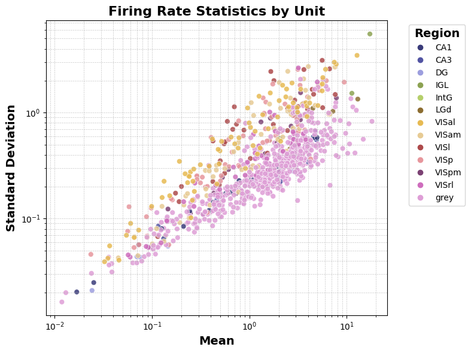

# Question

How does stimulus orientation affect the mean firing rate of neurons in different regions?

# Abstract

In this study, we analyze ecephys data from the Allen Brain Observatory to investigate how neural units in the mouse visual cortex respond to drifting gratings stimuli. Our aim is to identify brain regions and specific neurons that have a significant role in encoding stimulus orientation. We focus on the visual cortex, while keeping non-visual regions as a control group. We group neural firing rate across multiple trials and conditions to simplify the search. By selecting the most informative neurons based on their response, we construct a decoder capable of predicting stimulus orientation from neural activity.

# Introduction
Understanding how the brain encodes visual information, particularly the perception of orientation in the visual cortex, is a central goal in neuroscience. Orientation selectivity—the tendency of neurons to respond preferentially to visual stimuli of a particular orientation—is a fundamental feature of early visual processing. However, understanding the dynamics of neuron excitation in the brain is challenging due to the intrinsic complexity of inter-neuron connectivity. This investigation uses neuron firing rate statistics to differentiate cross-region and cross-stimuli behavior, shedding light on the distinction between different static grating orientations. We also uncover the relationship between neurons in different cortical regions and propose a simple model to understand 'superstar' neurons and regions.

We started our investigation by searching the _AllenSDK_ dataset for a session containing units from different brain regions. We finally chose study _750332458_ for its balanced distribution of units, especially those related to the visual cortex (VIS).

| region |     |
|--------+-----|
| grey   | 558 |
| VISal  |  71 |
| VISp   |  63 |
| VISam  |  60 |
| VISrl  |  44 |
| VISl   |  38 |
| VISpm  |  19 |
| CA1    |  16 |
| CA3    |  15 |
| DG     |   7 |
| IGL    |   5 |
| LGd    |   4 |
| IntG   |   2 |

As is clearly apparent, although most of the units are labelled 'grey', a good portion of them belongs to the Visual cortex and some recordings are present from other regions. 

# Dataset Characteristics

The dataset consists of time-aligned responses of different units (neurons) to different different stimuli. Although both stimuli and responses are characterized by multiple features, for the purpose of our investigation we focus our observations by grouping the responses only by stimulus orientation, and focusing our statistical study on the mean firing rate of each unit, for fixed stimulus orientation.

# Exploratory Data Analysis

Our investigation focuses on the relation between unit activations and the orientation of different grating stimuli. 

**Raster Plots**
- how individual neurons response across different orientations of static gratings
- compare timing / pattern of spikes to identify any distinct temporal patterns among neurons

## Firing Rate Baseline

We first observe how spiking rate varies between regions: in general, we notice a linear relation between the log of the mean and the log of the standard deviation of the firing rates. Visually, it is clear that simply observing mean and standard deviation is not enough to characterize the brain region, though some qualitative differences can be identified. 

For convenience, we also include both the single plots, showing each region singularly. It should be noted that since some regions contain little data, any conclusion is heavily subject to noise, thus should be considered unreliable.

## Single-Unit Analysis

**Firing Rate Calculation**
- for each neuron, average firing rate across all presented orientations
- orientation "tuning curves"? to determine each neuron's preferred orientation

**Selection Criteria**
- identify neurons that exhibit strong, consistent responses
- use statistical measures to pick neurons for reliable orientation encoding: OSI?

## Population-Level Analysis

**Grouping and Comparison**
- aggregate responses from groups or regions of neurons to explore population-level encoding of orientation
- compare activity patterns across brain regions 

**Cross Neuron Correlations**
- correlation of responses among neurons to detect collective dynamics or "network-level" integration of orientation info

# Classifier

**Classifier Construction**
- based on indiv neurons (or groups) that show clear tuning, build a classification model to predict orientation of static

**Training and Validation**
- accuracy / precision / recall you know the drill

## Comparative Analysis: Static vs Drifting Gratings

**Cross Condition Analysis**
- compare neurons that show up in both static/drifting

**Temporal Dynamics**
- Analyze the time aspects of responses in drifting, compare to static

## Final Product

*Orientation Decoder*

Robust decoder that can predict the orientation of a static grating based on the neural firing patterns.

Benchmark and validate it, comparing its performance across different conditions to assess consistency and generality of neural code for orientation.

# Methods
Present the findings of the study, including statistical analyses, figures, and tables where applicable.

Interpret the results, discuss their significance, compare them with previous research, and highlight potential limitations and future directions.

Summarize the key findings and their implications in the field of neuroscience.
