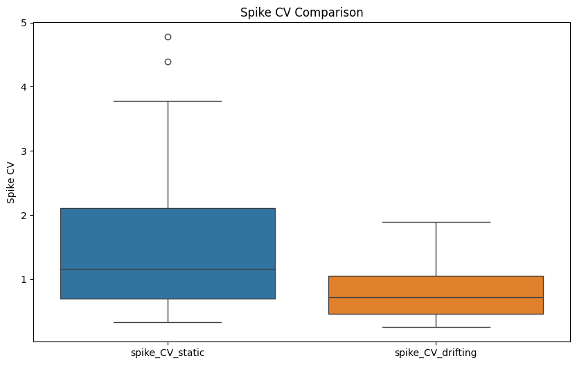
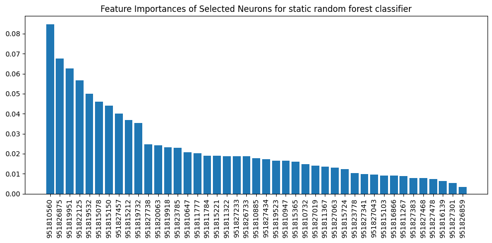
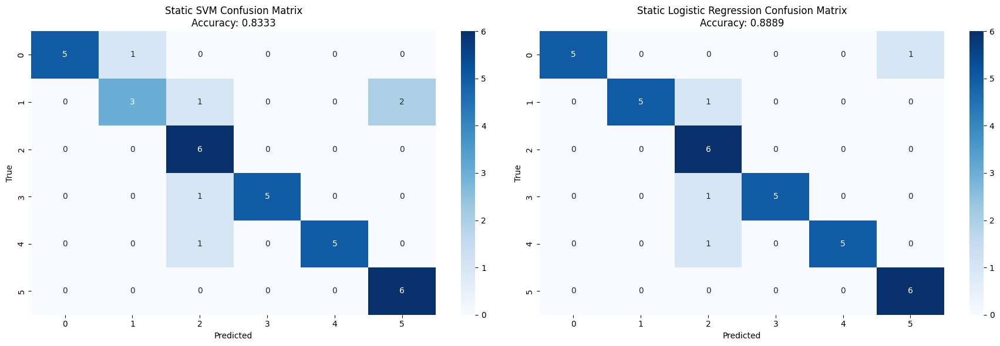
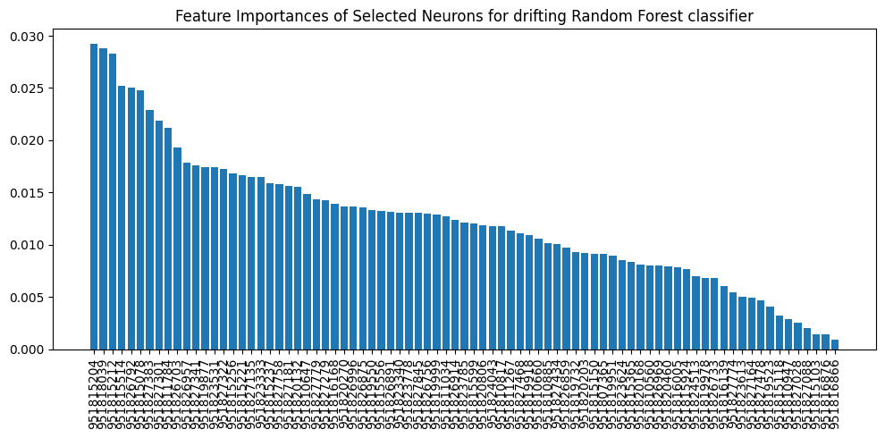
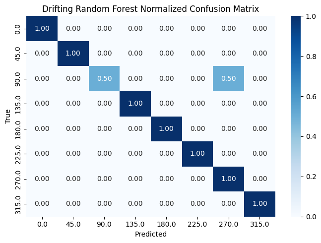
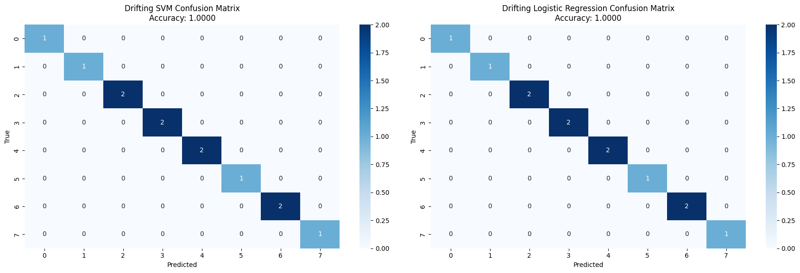

# Question

Investigating neuron responses to stimulus orientation in static and drifting gratings

# Abstract

In this study, we analyze ecephys data from the Allen Brain Observatory to investigate how neural units in the mouse visual cortex respond to drifting gratings stimuli. Our aim is to identify brain regions and specific neurons that have a significant role in encoding stimulus orientation. We focus on the visual cortex, while keeping non-visual regions as a control group. We group neural firing rate across multiple trials and conditions to simplify the search. By selecting the most informative neurons based on their response, we construct a decoder capable of predicting stimulus orientation from neural activity.

# Introduction
Understanding how the brain encodes visual information, particularly the perception of orientation in the visual cortex, is a central goal in neuroscience. Orientation selectivity—the tendency of neurons to respond preferentially to visual stimuli of a particular orientation—is a fundamental feature of early visual processing. However, understanding the dynamics of neuron excitation in the brain is challenging due to the intrinsic complexity of inter-neuron connectivity. This investigation uses neuron firing rate statistics to differentiate cross-region and cross-stimuli behavior, shedding light on the distinction between different static grating orientations. We also uncover the relationship between neurons in different cortical regions and propose a simple model to understand 'superstar' neurons and regions.

We started our investigation by searching the _AllenSDK_ dataset for a session containing units from different brain regions. We finally chose study _750332458_ for its balanced distribution of units, especially those related to the visual cortex (VIS).

| region |     |
|--------+-----|
| grey   | 558 |
| VISal  |  71 |
| VISp   |  63 |
| VISam  |  60 |
| VISrl  |  44 |
| VISl   |  38 |
| VISpm  |  19 |
| CA1    |  16 |
| CA3    |  15 |
| DG     |   7 |
| IGL    |   5 |
| LGd    |   4 |
| IntG   |   2 |

As is clearly apparent, although most of the units are labelled 'grey', a good portion of them belongs to the Visual cortex and some recordings are present from other regions. 

# Data Processing

The dataset consists of time-aligned responses of units (neurons) to stimuli. Although both stimuli and responses are characterized by multiple features, for the purpose of our investigation we focus our observations by grouping the responses only by stimulus orientation, and focusing our statistical study on the mean firing rate of each unit, for fixed stimulus orientation.

# Exploratory Data Analysis

Our investigation focuses on the relation between unit activations and the orientation of different grating stimuli. 

**Raster Plots**
- how individual neurons response across different orientations of static gratings
- compare timing / pattern of spikes to identify any distinct temporal patterns among neurons

## Decoding static vs drifting 

Before diving into decoding orientation we wanted to see how spike count and variability (across presentations) differed between static and drifting gratings in the visual cortex (VISam). We discovered that the spike count per presentation (spike mean) was generally much higher for the same units in drifting gratings than in static gratings. We tested these findings with a paired Wilcoxon signed-rank test (alpha=0.05) which revealed a signifcant p-value (0.000) allowing us to reject the null hypothesis that units fire equally frequently for static and drifting gratings. We then performed the same analysis on spike Coefficient of Variation (CV = std/mean) which revealed the reverse, units had greater variability when presented with static gratings (p-value 0.000). 
    We then built a two Random Forest classifier with 5-fold cross validation using just spike_mean and spike_CV 
respectively. Model 1 using spike_mean attained an accuracy of 1.000 +- 0.000 and model 2 using spike_CV attained 0.933 ± 0.033. Clearly it is easy to effectively decode whether the stimulus is static or drifting gratings from the simple measures such as spike count per presentation.

    

## Firing Rate Baseline

We first observe how spiking rate varies between regions: in general, we notice a linear relation between the log of the mean and the log of the standard deviation of the firing rates. Visually, it is clear that simply observing mean and standard deviation is not enough to characterize the brain region, though some qualitative differences can be identified. 

For convenience, we also include both the single plots, showing each region singularly. It should be noted that since some regions contain little data, any conclusion is heavily subject to noise, thus should be considered unreliable.

# Selection of Neurons
## Orientation Selectivity Analysis
We quantified orientation selectivity of neurons in the  visual cortex using the Orientation Selectivity Index (OSI), defined as:
$OSI = (R_{preferred} - R_{orthogonal})/(R_{preferred} + R_{orthogonal})$
where R_preferred represents the mean firing rate at the preferred orientation and R_orthogonal represents the mean firing rate at the orthogonal orientation (90° offset from preferred). This analysis revealed a subset of neurons with pronounced orientation tuning (OSI > 0.5), which will provide good grounds for training a model.

## Statistical Validation of Orientation Tuning
To statistically validate orientation tuning, we employed one-way ANOVA tests for each unit, comparing spike counts across different orientation presentations. The null hypothesis posited equal mean spike counts across all orientations, with the alternative hypothesis suggesting significant response differences to at least one orientation. This analysis identified a substantial population of neurons (p < 0.05) exhibiting statistically significant orientation tuning, confirming the presence of orientation-encoding properties within the dataset.

## Selection Criteria for Orientation-Selective Neurons
We established the following criteria for neuron selection:
1. High orientation selectivity (OSI > 0.5)
2. Statistically significant orientation tuning (ANOVA p < 0.05)

#### Static

This approach yielded a population of 43  orientation-selective neurons distributed in the visual cortex, with notable concentrations in the VISal and VISl areas. The anatomical distribution of these neurons aligns with established literature on the hierarchical organization of orientation processing in the mouse brain. INCLUDE SOURCE!!!

Visualization of orientation tuning curves from representative neurons revealed diverse response profiles, including:
- Narrowly tuned neurons with a strong response to one specific orientation
- Neurons with a broader reaction to a few concurrent orientations

These different tuning properties are likely beneficial to the encoding of orientation in the visual cortex, helping to discriminate between different orientations of visual stimuli.

#### Drifting

The same approach for drifting gratings was then employed with the same selection criteria. It revealed 81 orientation-selective neurons (almost double) many of which had higher OSI values between 0.8-1.0. Similarly, all were located in the visual cortex, predominantly in VISal, bar one which was in 'grey'. 

The tuning curves were similarly conveying diverse reponse profiles with very strong responses to specific orientations. Though, the drifting tuning curves showed more peakedness around the preferred orientation, this is probably largely due to the fact that the difference between adjacent orientations is 45° instead of 30° and is not solely because the grating is drifting. 
Moreover, unlike Static here the orientations spanned a full 360° with the 45° increments giving 8 different orientations. A very interesting result was that orientations 180° apart both had very strong responses, where the gratings has the same orientation but is drifting in the opposite direction. Indeed it seems the units in general seemed to be more selective to orientation than direction. We wanted to test this by investigating DSI (Direction-sensitivity index).

$DSI = (R_{preferred} - R_{opposite})/(R_{preferred} + R_{opposite})$

Using the same selection criteria above except using DSI > 0.5 instead only 8 neurons were left over supporting this hypothesis.

# Decoding Orientation from Neural Activity

To assess whether the activity patterns of orientation-selective neurons could reliably predict stimulus orientation, we implemented a machine learning approach using the spike counts of selected neurons as features. The static dataset consisted of spike count responses to static grating stimuli presented at six distinct orientations (0°, 30°, 60°, 90°, 120°, and 150°). Whereas the drifting datases the same but from 8 distinct orientations (0°, 45°, 90°, 135°, 180°, 225°, 270°, 315°, 360°) as direction is considered. The classification task involved predicting the stimulus orientation from the corresponding neural activity patterns.

## Data Preparation and Model Training
We constructed a feature matrix where each row represented a stimulus presentation (indexed by stimulus_condition_id) and each column represented the spike count of an orientation-selective neuron. The target variable consisted of the corresponding orientation values. The dataset was stratified and split into training (70%) and testing (30%) sets to ensure proportional representation of all orientation classes. The static dataset consists of 20 presentations per orientation whereas the drifting dataset only consists of 5 presentations per orientation, a limitation to be considered. 

Prior to model training, features were standardized using z-score normalization to account for differences in baseline firing rates across neurons. We evaluated three classification algorithms:

- Random Forest Classifier
- Support Vector Machine (SVM) with linear kernel
- Multinomial Logistic Regression

## Classification performance

#### Results

For decoding orientation for static gratings we achieved an accuracy of

Random Forest        - 0.8611 /n
SVM                  - 0.8333 /n
Logistic Regression  - 0.8889 /n

Feature selection // confusion matrices // maybe a bit more discussion    ???

For decoding orientation for drifting gratings we achieved an accuracy of 

Random Forest        - 0.9167
SVM                  - 1.0000
Logistic Regression  - 1.0000

#### Model conclusions

Why did we get much better results for decoding drifting gratings? A number of factors. Firstly, we have more orientation-selective neurons available as features 81 vs 43. Secondly, more of these neurons have higher OSI values. However, it must be considered that this is also probably due to the fact that the difference in orientation is 30° for Static and 45° which makes decoding orientation much easier. Once again this difference in the available orientations of static and drifting gratings is a big limitation of our analysis. A last note is that our model findings are also limited by the fact we don't have that many presentations per orientation, especially for drifting where it is only 5. 

## Cross condition analysis between static and drifting stimuli

#### Distribution of the OSI values

At this point we wanted to dig deeper into the difference in OSI between static and drifting gratings by looking at the distribution of the OSI values. 

Looking into the skewness and kurtosis:

Static Gratings:
  Skewness : 2.258
  Kurtosis : 5.009

Drifting Gratings:
  Skewness : 1.937
  Kurtosis : 3.397

We can draw a number of conclusions from the distribution of OSI values for units between the two stimuli. 

1) As we would expect the distribution is highly non-normal. Only a few neurons have a high OSI and are responsible for interpreting orientation.
2) Drifting activates more neurons with high OSI overall.
3) Static distribution illicits a higher kurtosis (5.009 > 3.397) indicating a narrower sharper peak and heavier tails than drifting. This suggests fewer relatively higher tuned neurons. This can probably be interpreted as the drifting nature of the grating is a kind of noise which triggers a greater response in neurons in general instead of a few concentrating on orientation only.

Interestingly we see these results in the feature selection of our random forest models for static and drifting. For static fewer units make up a relatively much larger impact on the models decision than for drifting gratings. As for drifting many units have a high OSI value. 

#### Distribtion of orientation-selective neurons over regions

The distribution of well-tuned neurons across regions is very similar given that there are twice as many well-tuned neurons for drifting as static. Only exceptions are that VISl seems to have greater relative importance for static stimuli whereas VISrl has greater relative importance for drifting. It would be interesting to see if this is the case in other sessions as well.

#### Overlapping neurons for static and drifting 

We were also interested to see if it was the same units that were orientation-selective for both static and drifting gratings. We found that of the 43 units identified as significant for static gratings 29 were also significant for drifting gratings, well over half conveying it is largely the same units dealing with orientation in both cases as we might expect.

#### Also look at if its the same units responsible for the same orientations (0 and 90 degrees only possible)

Code for these results is at the bottom of 04. I couldnt run the code as the notebook lost the variables and I cant be asked to wait 50 mins to run the functions again if anyone can do it faster. 

 ## Conclusions

 We can draw a number of conclusions from our analysis into decoding orientation from gratings stimulus. Principally, it is indeed possible to effectively decode the orientation of gratings from neural response using the spike count over presentations. It seems especially effective for drifting gratings where units have higher OSI values and are generally more orientation-selective. We also found however that of those orientation-selective neurons in static gratings they had a relatively much higher OSI score. This was conveyed by the static distribution of OSI values having higher kurtosis and was reflected in the feature importance of the model. 

 ## Limitations and suggestions for further study

 There are a few limitations to our study. Largest of all is that there is a discrepancy in the angle of orientation between the static and drifting stimulus given to use in the AllenSDK dataset, 30° differences in static vs 45° in drifting. This is a large limitation on comparing our relative model performance between the two stimuli. However, it does not really limit our comparative analysis for OSI as this uses the preferred and orthogonal values for stimulus count which is the same for both. Nevertheless, it would be interesting in further study to have the same orientations for both and then to measure the difference in decoding performance.

 Another big limitation is naturally that here we have only looked at one session of one mouse. Further research should perform the same procedure with other mice to see if the results are consistent. 

 Finally, another limitation lies in the nature of the stimulus gratings. Here we have focused on the orientation only. However, for static gratings the spatial frequencies and phases also varies while in drifting the temporal frequency varies. More stringent analysis should control these variables and keep the constant over presentations. 

 Any others???

Old write up parts 

## Classification Approach
To assess whether the activity patterns of orientation-selective neurons could reliably predict stimulus orientation, we implemented a machine learning approach using the spike counts of selected neurons as features. The dataset consisted of spike count responses to static grating stimuli presented at six distinct orientations (0°, 30°, 60°, 90°, 120°, and 150°). The classification task involved predicting the stimulus orientation from the corresponding neural activity patterns.

## Data Preparation and Model Training
We constructed a feature matrix where each row represented a stimulus presentation (indexed by stimulus_condition_id) and each column represented the spike count of an orientation-selective neuron. The target variable consisted of the corresponding orientation values. The dataset was stratified and split into training (70%) and testing (30%) sets to ensure proportional representation of all orientation classes.
Prior to model training, features were standardized using z-score normalization to account for differences in baseline firing rates across neurons. We evaluated three classification algorithms:

- Random Forest Classifier
- Support Vector Machine (SVM) with linear kernel
- Multinomial Logistic Regression

## Classification Performance

## Feature Importance Analysis

Performance on Drifting Gratings

**Cross Condition Analysis**
- compare neurons that show up in both static/drifting

**Temporal Dynamics**
- Analyze the time aspects of responses in drifting, compare to static

# Limitations

# Conclusion 

*Orientation Decoder*

Robust decoder that can predict the orientation of a static grating based on the neural firing patterns.

Benchmark and validate it, comparing its performance across different conditions to assess consistency and generality of neural code for orientation.

# Citations